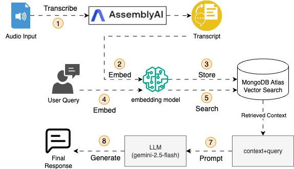
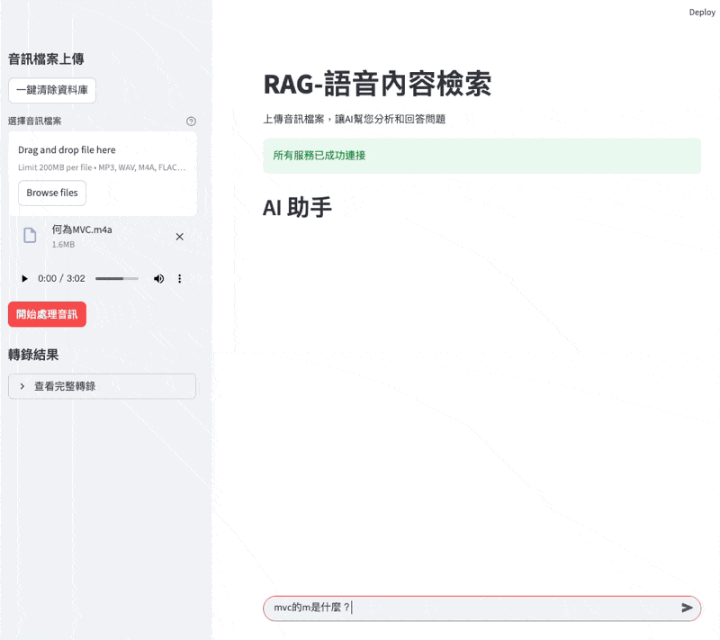

# RAG Over Audio - 語音內容檢索系統

將 語音內容 轉換為可檢索的逐字稿，並透過 RAG 讓使用者可以針對音檔內容進行問答。
使用者只需上傳音檔，即可立即提問，並獲得基於內容的回答。

### RAG 流程





## 使用方式

1. 設定環境變數 (`.env`)：
   ```
   ASSEMBLYAI_API_KEY=your_key
   VOYAGE_API_KEY=your_key
   MONGODB_CONNECTION_STRING=your_connection_string
   GEMINI_API_KEY=your_key
   ```

2. 安裝相依套件：
   ```bash
   pip install -e .
   ```

3. 啟動應用：
   ```bash
   streamlit run rag.py --server.headless=true --server.port=850
   ```

4. 上傳音訊檔案並開始提問